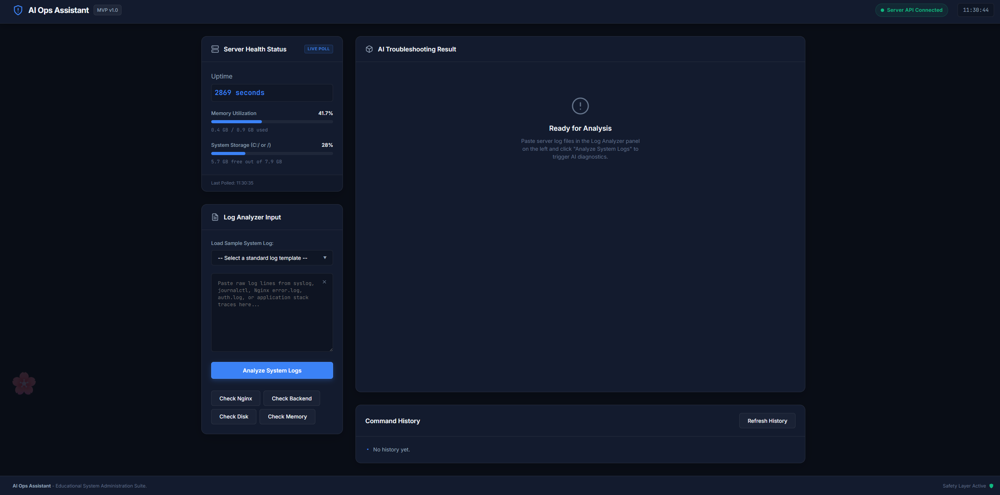
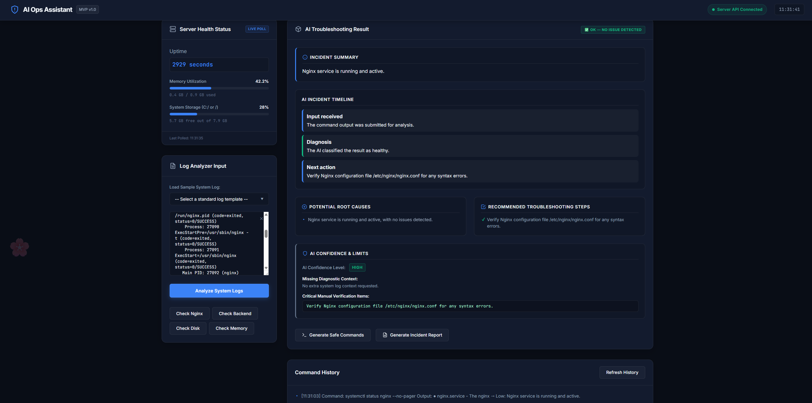

# AI Ops Assistant — Automated AWS DevOps Deployment

## Overview

AI Ops Assistant is a cloud-hosted AI-powered troubleshooting platform designed to help system administrators and DevOps engineers analyze logs, identify incidents, and generate troubleshooting recommendations automatically.

The project combines:

- AWS EC2 infrastructure
- Terraform Infrastructure as Code (IaC)
- Nginx reverse proxy
- Node.js backend
- PM2 process management
- AI-powered log analysis using Groq
- Automated HTTPS deployment with Certbot
- Dynamic DNS using DuckDNS

The infrastructure is fully reproducible and can be destroyed and rebuilt automatically using Terraform.

---

## Architecture Documentation

Detailed infrastructure diagram and deployment flow:

- [Architecture Diagram](docs/architecture.md)

---

# Live Deployment

Example production URL:

```text
https://shaki-aiops.duckdns.org
```

---

## Application Preview

### Dashboard Overview



---

### AI Incident Analysis



---

# Key Features

## AI-Powered Diagnostics

- AI-based log analysis
- Root cause identification
- Severity classification
- Recommended remediation steps
- Timeline-style incident visualization

## Infrastructure Automation

- One-command deployment using Terraform
- Automated EC2 provisioning
- Automated Nginx configuration
- Automated PM2 setup
- Automated HTTPS certificate generation
- Automated DuckDNS updates

## Frontend Dashboard

- Interactive monitoring interface
- Command history panel
- Replay previous analyses
- Timeline visualization
- Responsive modern UI

---

# Architecture

```text
Browser
   ↓
Nginx Reverse Proxy
   ↓
Node.js Backend (PM2)
   ↓
Groq AI API
```

---

# Tech Stack

| Component | Technology |
|---|---|
| Cloud Provider | AWS EC2 |
| Infrastructure | Terraform |
| Backend | Node.js + Express |
| Frontend | HTML / CSS / JavaScript |
| Reverse Proxy | Nginx |
| Process Manager | PM2 |
| AI Provider | Groq API |
| HTTPS | Certbot + Let's Encrypt |
| Dynamic DNS | DuckDNS |

---

# Repository Structure

```text
ai-ops-assistant/
│
├── backend/
│   ├── prompts/
│   ├── server.js
│   ├── package.json
│   └── .env.example
│
├── frontend/
│   ├── index.html
│   ├── app.js
│   └── style.css
│
├── scripts/
│   └── recover_ec2.sh
│
├── main.tf
├── variables.tf
├── outputs.tf
├── terraform.tfvars.example
├── user-data.web.sh
├── README.md
└── .gitignore
```

---

# Automated Deployment Workflow

## 1. Clone Repository

```bash
git clone https://github.com/YOUR_USERNAME/ai-ops-assistant-aws.git
cd ai-ops-assistant-aws
```

---

## 2. Configure Terraform Variables

Create a local, untracked `terraform.tfvars` from environment variables:

```bash
export TF_VAR_groq_api_key="your-private-groq-key"
export TF_VAR_duckdns_token="your-private-duckdns-token"
export TF_VAR_admin_password="your-private-admin-password"
export TF_VAR_user_password="your-private-user-password"
export TF_VAR_auth_token_secret="your-long-random-secret"
./scripts/create_tfvars_from_env.sh
```

Use `terraform.tfvars.example` for placeholder structure only. Do not commit real secrets.

---

## 3. Deploy Infrastructure

```bash
terraform init
terraform apply
```

Terraform automatically:

- Creates the EC2 instance
- Installs dependencies
- Clones the repository
- Configures Nginx
- Starts PM2
- Configures DuckDNS
- Generates HTTPS certificates

---

# Accessing the Application

After deployment:

```text
https://YOUR_DOMAIN.duckdns.org
```

---

# HTTPS Automation

HTTPS is automatically configured using:

- Certbot
- Let's Encrypt
- Nginx integration

Certificates are generated during deployment.

---

# DuckDNS Integration

DuckDNS is used to provide a free domain name dynamically linked to the EC2 public IP address.

The deployment automatically:

- Updates DNS records
- Configures HTTPS for the domain
- Maintains connectivity after redeployment

---

# PM2 Process Management

The backend is managed using PM2.

Useful commands:

```bash
pm2 status
pm2 logs ai-ops-backend
pm2 restart ai-ops-backend
```

PM2 startup is configured automatically so the backend restarts after server reboot.

---

# Security Practices

## Protected Secrets

Sensitive values are excluded from Git:

- `.env`
- `terraform.tfvars`
- runtime history files

## HTTPS Encryption

All traffic is encrypted using Let's Encrypt certificates.

## Reverse Proxy Protection

The backend is not exposed directly to the internet. All traffic passes through Nginx.

---

# Troubleshooting Guide

## Nginx Errors

Check status:

```bash
sudo systemctl status nginx
```

Check logs:

```bash
sudo tail -f /var/log/nginx/error.log
```

---

## Backend Errors

Check PM2:

```bash
pm2 logs ai-ops-backend
```

---

## Terraform Validation

```bash
terraform fmt
terraform validate
```

---

# Development Challenges Solved

During development several production-like issues were identified and resolved:

- EC2 memory instability
- API key authentication failures
- Nginx permission errors
- HTTPS certificate validation problems
- Git ownership conflicts
- PM2 persistence issues
- DNS propagation problems
- Reverse proxy configuration issues

These debugging sessions significantly improved deployment reliability and infrastructure automation.

---

# Future Improvements

Potential future enhancements:

- Docker containerization
- Kubernetes deployment
- CI/CD with GitHub Actions
- Database persistence
- User authentication system
- Monitoring and alerting
- AWS SSM Parameter Store integration
- Multi-instance scalability

---

# Recovery Workflow

If the EC2 instance is destroyed:

```bash
terraform apply
```

The infrastructure and application stack are rebuilt automatically.

---

# Useful Commands

## Destroy Infrastructure

```bash
terraform destroy
```

---

## View Terraform Outputs

```bash
terraform output
```

---

## SSH into EC2

```bash
ssh -i ~/.ssh/YOUR_KEY.pem ec2-user@YOUR_PUBLIC_IP
```

---

# License

This project is intended for educational, DevOps learning, and infrastructure automation purposes.

---

# Project Status

Current Status:

```text
Production-like automated deployment working successfully
```
